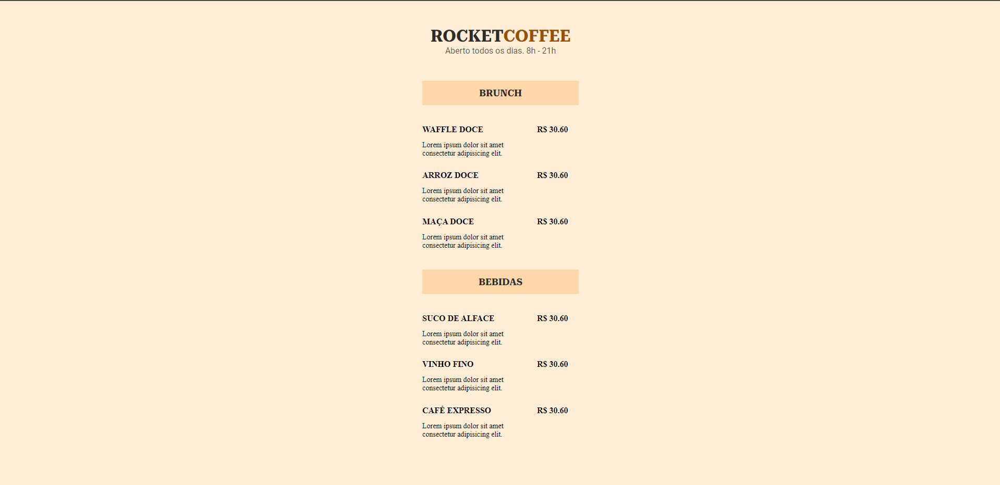

# RocketCoffee

<h1 align="center">Rocket Coffee</h1>

 Projeto feito na terceira edição do Rocketseat Explorer.  

  <a href="#-tecnologias">Tecnologias</a>&nbsp;&nbsp;&nbsp;|&nbsp;&nbsp;&nbsp;
  <a href="#-projeto">Projeto</a>&nbsp;&nbsp;&nbsp;|&nbsp;&nbsp;&nbsp;
  <a href="#memo-licença">Licença</a>

  

 

     

## 🚀 Tecnologias

-Nesse projeto foi utilizado as seguintes tecnologias para ter mais conhecimento e experiência no desenvolvimento WEB:

-CSS  
-HTML  
-Figma  
-Github  

## 💻 Projeto

- [Visite o projeto online](https://helenapl145.github.io/RocketCoffee/)

Esse projeto está sob a licença MIT.

---

Feito com ♥ by Helena Lima

